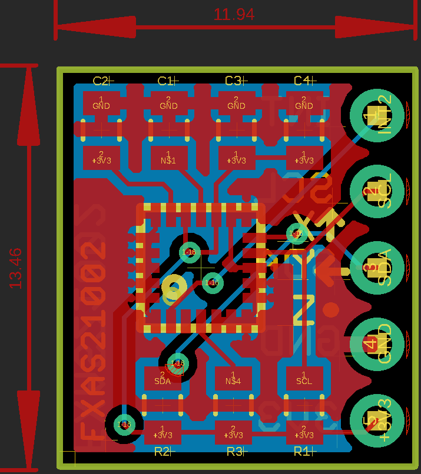
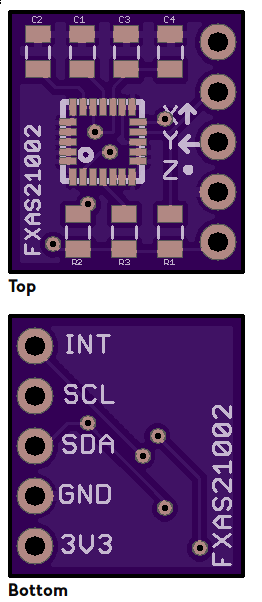

# FXAS21002 breakout

This is a modified version of [William Laney's breakout](https://github.com/WLaney/FXAS21002-gyro-PCB) designed to be as small as possible.

Note: The SAO pin is pulled to GND, so the I2C address will be 0x20. If you are using a library that hardcodes the address to 0x21 (Adafruit's for instance), you may need to modify it.

